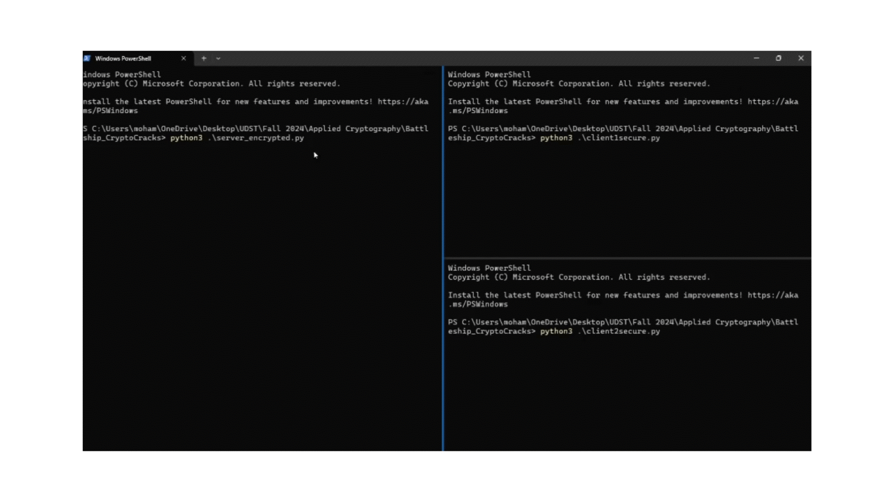

# Secure Battleship

This project implements a secure two-player Battleship game using network communication and applied cryptography. Players connect and exchange encrypted messages during gameplay, ensuring data security and fair play.

## Table of Contents

*   [Project Description](#project-description)
*   [Phases of Implementation](#phases-of-implementation)
*   [Key Features](#key-features)
*   [Installation Instructions](#installation-instructions)
*   [Usage Instructions](#usage-instructions)
*   [Authors](#authors)

## Project Description 

The Battleship project follows the classic game rules: a 10x10 grid is generated, and players take turns attacking, trying to sink all of their opponent's ships. This version utilizes cryptography to enhance security. Players connect via a network (sockets) and exchange encrypted messages during gameplay. The primary goals are:

*   Secure data transmission
*   Ensure fair play

## Phases of Implementation 

This project was developed in five phases:
*   **[Phase 1: Historical Symmetric Key Encryption:](./Phase1_Ciphers.py)** Explored classical symmetric encryption algorithms for encrypting numeric data. Implemented and tested various ciphers, including Caesar, Monoalphabetic, Homophonic, Playfair, Vigenère, Autokey, Rail Fence, Columnar Transposition, Affine, and Hill ciphers. Developed corresponding decryption functions for each cipher.
*   **[Phase 2: Modern Symmetric Ciphers:](./phase2.py)** Focused on security and efficiency by implementing modern symmetric ciphers like AES, DES, 3DES, and Blowfish. Utilized the CBC mode for AES. Used the PyCryptodome library.
*   **[Phase 3: Game Logic:](./server_encrypted.py)** Developed the Battleship game logic to manage grid creation, ship placement, and turn-based gameplay. Encoded ships of varying sizes with numeric values and placed them on a 10x10 grid. Implemented a random generation function for valid ship placement. Encoded logic for handling hits, misses, and sunk ships.
*   **[Phase 4: Client-Server Interaction:](./server_encrypted.py)** Developed a game server using socket programming to mediate communication between players and securely transmit data using encrypted messages (plaintext mode available for testing). Implemented turn-based signals and attack results (hit, miss, sink) transmission between server and clients. The server uses signals: `[1]` for the active player's turn, `[0]` for the waiting player, and `[2]` to both players when the game is over.
*   **[Phase 5: Public Key Distribution:](./phase5.py)** Designed a secure communication protocol for distributing symmetric encryption keys. AES in CBC mode was chosen for secure message transmission. PyCryptodome was used for generating AES keys. Keys are encrypted using each player's public key and sent through the server. Private keys are securely stored. Public keys are shared in plaintext. Server and players generated public-private key pairs using the square-and-multiply algorithm.

## Key Features 

*   Socket Programming for network communication
*   Symmetric Encryption using AES for secure data transmission
*   Asymmetric Encryption (RSA) for secure key exchange
*   Server-Client Model for communication structure

## Installation Instructions 

**Prerequisite:** Python must be installed.

**Installation Steps:**

If Python is installed, install the required cryptography library:

`pip install pycryptodome`

## Usage Instructions 

**Requirements:** Libraries installed successfully.

**Setup:**

1.  Run the `GameServer` and `Player` scripts.
2.  The server initializes the game.

**Game Start:**

Players receive their grids from the server.

**Gameplay:**

Players take turns attacking by sending coordinates to the server. The server processes the attack and informs players of the result.

**Game Over:**

Once all ships of a player are sunk, the server notifies both players, and the game ends.

Here is the usage demo recording:

## Authors 

The project was completed collaboratively by:

*   [@Mohammad Ashjar](https://github.com/mohammadAshjar)
*   [@Hafsa Farhan](https://github.com/HafsaFarhan127)
*   [@Mohammed Fazil](https://github.com/mohammedFazil3)
*   [@Misbahul Haque](https://github.com/MisbahulHaque700)
*   [@Mujtaba Shahid](https://github.com/mujii974)
